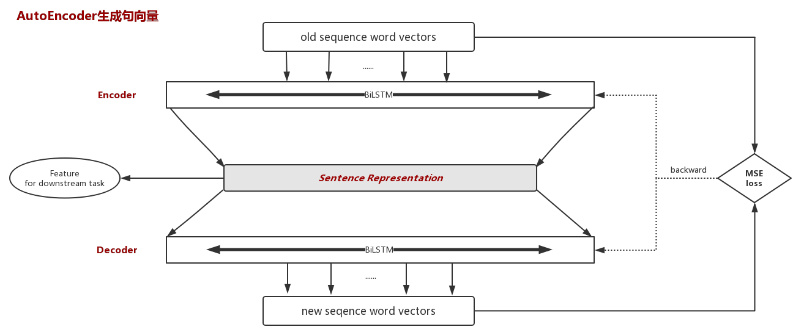
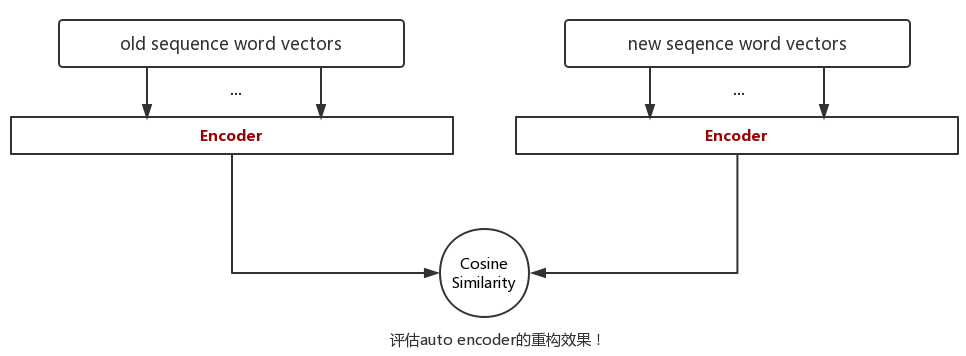

# AutoEncoder
generated sentence representation by auto encoder:

This simplified demo shows a scheme how to get sentence-level representation in NLP by using unsupervised auto-encoder system. Then, we can adaptively apply the compressed sentence-level feature to downstream tasks (e.g. text classification).

It's hard to evaluate the rebuilding ability of auto-encoder only to observe *mean square loss*. Therefore, I consider utilizing *cosine similarity* value for better evaluating the performance. (What you need to pay attention to is that we don't directly calculate the cosine similarity value between new sequence word vectors and old ones but through encoder first)

[Semi-supervised Sequence Learning](https://arxiv.org/pdf/1511.01432.pdf) (SA-LSTM) is a practical demo.

**将无标签数据进行无监督学习来的模型参数初始化有监督学习模型！**
